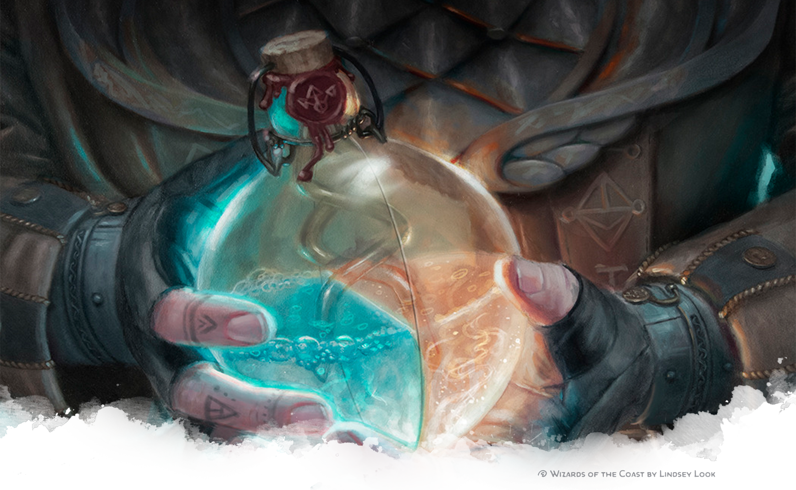
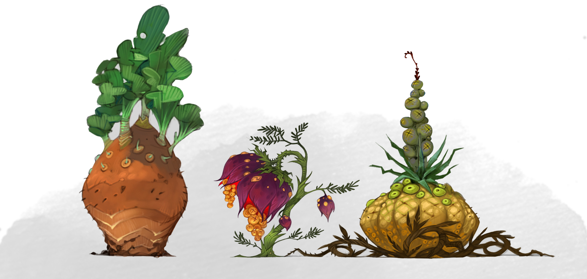
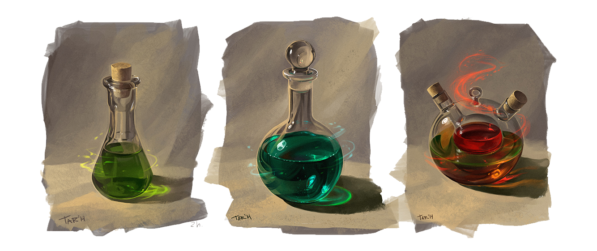

# Poisons

Poisons are a common weapon in the arsenal of many adventurers. Creating the most deadly toxins requires a lot of patience and skill. But anyone who finds a recipe can attempt to make a poison.

## Types of Poison

There are four types of poisons: **ingested**, **contact**, **injury** and **inhaled**.

- Ingested poisons are the easiest to make and can be used to poison a cup of wine or a delicious meal.
- Contact poisons need to merely touch the skin of their victims to work.
- Injury poisons can be applied to weapons, or the like, that perform piercing or slashing damage.
- Inhaled poisons are the most difficult to make, but need only be inhaled by your target to do their damage.

## Rarity of Poisons

The rarity of poison is determined by the rarest component required by its recipe. When you brew a poison, you can use rare components, but this does not increase the rarity of the poison or improve its effects in anyway.

## Brewing Poisons

In order to brew a poison, an adventurer needs to know the recipe listing all the requirements. Similar to spells, some can be replaced by gold and others cannot. The requirements for a poison are split into components and ingredients.

**Ingredients** are everyday items, such as water, vinegar, etc. These can be replaced by a gold cost. It is assumed that an adventurer can acquire these items for the stated cost as part of the poison making process.

**Components** are not so easily come by and cannot be replaced by gold. This does not mean that these cannot be bought at the right places for the right price. Furthermore, the properties of these components will determine the strength and effects of the poison.

 Brewing Difficulty

| Rarity    | Brewing  | CR  | DC  |
| --------- | -------- | --- | --- |
| common    | 8 hours  | any | 10  |
| uncommon  | 16 hours | 1+  | 15  |
| rare      | 24 hours | 6+  | 20  |
| very rare | 32 hours | 14+ | 25  |
| legendary | 40 hours | -   | 30  |

Mixing a poison takes a number of hours, sometimes even days or weeks. And the process is concluded with an ability check with a *poisoner's kit*. The required time and 
DC can be determined by the rarest component involved. The [*Brewing Difficulty*](./poison#brewing-difficulty-table) table shows the standard DC and time needed. But these can be overruled by the poison recipe.

On a successful check, you create the poison which has the rarity of its rarest required component (not the rarest used).
On a fail, the resulting brew is useless and all the involved components are destroyed.

## Making Antidotes

The same techniques you use to create poisons can also be used to brew antidotes. Using a *poisoner's kit*, an adventurer can attempt to create an antidote for a specific poison.

In order to do this, you need one dose of the poison you wish to cure and one *restorative* component of the same rarity as the poison. The time required to brew the potion usually takes one eighth of the brewing time of the poison, but the tool check DC is the same.

## Components

Components are both natural and synthetic ingredients which form the basis of any poison recipe. They can be acquired, refined and used in many different ways.

### Types and Rarity

There are four types of components: **befuddling** (purple), **corrupting** (black), and **venomous** (green), **restorative** (white).

Components also differ in potency. Alchemists codify potency in five levels of rarity: **common**, **uncommon**, **rare**, **very rare**, and **legendary**. Legendary components cannot be found in the wild, but only refined from other components.

### Generic Components

Generic components are interchangeable. When a poison recipe asks for two befuddling (purple) and one venomous (green) components, any component of those types can be used. However, thee components must be used. Any component with multiple types can only be used for one of the requirements.

### Unique Components

Some poison recipes may ask for unique components. These components have special properties which can be used to make unique and often powerful poisons. They still have a type, and can be used as generic components as well.

## Gathering Components

Many components can be found in nature. Most plants and fungi can be harvested easily by anyone with a glove and a knife. Other poisons require more skill to extract, for instance the venom from a giant spider, or the poisonous gas from a green dragon.

Gathering components typically takes two steps. As the first optional step, an adventurer can scavenge for resources which may yield useful components. After finding a resource&mdash;such as a slain monster&mdash;you can attempt to extract a component from it.

### Scavenging

A scavenging character makes a **Wisdom (Survival) check** whenever you call for it, with a DC determined by the abundance of food and water in the region. If multiple characters scavenge, each character makes a separate check. A scavenging character finds nothing on a failed check. On a successful check, it finds a resource from which it can attempt to extract a component.

::: tip Note to DMs

As a guideline, you can consult the [*Scavenging Difficulty*](./poison#scavenging-difficulty-table) table, which associates a biome's resource availability with a scavenging DC.

:::

Scavenging Difficulty

| Resource Availability | DC  |
| --------------------- | --- |
| Abundant              | 10  |
| Limited               | 15  |
| Very Little           | 20  |

### Extracting

Many of the resources adventurers find while foraging, are easily extracted and require no check. But some plants are dangerous, some stones need to be quarried, and extracting poison from a slain monster requires the right tools.

An adventurer can simply try to extract a component with their bare hands or the simple tools at their disposal. In that case, they simply make a **Wisdom (Nature) check**. An adventurer may also extract poisons, with a *poisoner's kit*. They make an ability check with the tool instead.

::: tip Note to DMs

To determine the DC for an extraction, the DM can use the [*Brewing Difficulty*](./poison#brewing-difficulty-table) table.
When extracting from a slain monster, you can use the CR of the monster to determine the DC.
The table does not list a CR for legendary components because these can not be found in the wild.

It is encouraged to adapt the DC to the specific situation, such as whether the adventurer uses a *poisoner's kit*, or the volatility of the resource.

:::

In either case, on a successful check, the extractor gains one component.
On a fail, the resource becomes exhausted and cannot be used for at least 48 hours.

## The Process of Refinement

Skilled poisoners can turn natural components into even more powerful version. Stones are turned into powder, herbs are distilled into extract, and from other components essences are made.
Anyone with a *poisoner's kit* can try to refine a component.
Refinement requires a long rest to perform per level of rarity of the base material.
Taking a maximum of 4 long rests for a very rare component.
These long rest need not be consecutive.

After the last long rest the refinement process, the refiner makes an ability check with their *poisoner's kit*.
The [*Brewing Difficulty*](./poison#brewing-difficulty-table) table can be used to determine the DC for refining a component.
The DC depends on the rarity level of the base components.
When successful, the resulting artificial component is exactly one level of rarity higher than their base component.
On a fail, the component is destroyed and worthless.

A refined component is synthetic, and cannot be refined further.

## Using Poisons

How you employ your poisons is determined primarily by the type of poison.

**Contact.** Contact poison can be smeared on an object and remains potent until it is touched or washed off. A creature that touches contact poison with exposed skin suffers its effects.

**Ingested.** A creature must swallow an entire dose of ingested poison to suffer its effects. The dose can be delivered in food or a liquid. You may decide that a partial dose has a reduced effect, such as allowing advantage on the saving throw or dealing only half damage on a failed save.

**Inhaled.** These poisons are powders or gases that take effect when inhaled. Blowing the powder or releasing the gas subjects creatures in a 5-foot cube to this effect. The resulting cloud dissipates immediately afterwards. Holding one's breath is ineffective against inhaled poisons, as they affect nasal membranes, tear ducts, and other parts of the body.

**Injury.** Injury poison can be applied to weapons, ammunition, trap components, and other objects that deal piercing or slashing damage and remains potent until delivered through a wound or washed off. A creature that takes piercing or slashing damage from an object coated with the poison is exposed to its effects. Applying a poison to a weapon takes an action.

## Identifying Poisons

You can make an ability check with a poisoner's kit to identify a single dose of poison or antidote.
Researching a potion in this way takes one hour.
At the end, you learn all properties of the poison or antidote.

The [*Brewing Difficulty*](./poison#brewing-difficulty-table) table can be used to determine the DC using the rarity of the poison.

## Learning Recipes

To make a poison, you first need to learn its recipe. The easiest way is to find or buy a written down version. But an alchemist can attempt to learn the recipe of a poison by using a *poisoner's kit* on a dose of the poison. In order to learn the recipe of a poison, you must first know all properties of the potion.

This process takes one long rest, and a successful tool check. On a success, you learn the complete recipe of the poison.
On a fail, the sample is destroyed and you learn nothing.
Again, the [*Brewing Difficulty*](./poison#brewing-difficulty-table) table can be used to determine the DC using the rarity of the poison.

## Effectiveness

When a creature which is already under the effect of a poison, suffers an additional dose of same poison , its effect are not compounded.
Instead, the duration of the effect is refreshed.
The only exception is instant non-recurring damage, which is reapplied.

Other poisons still enjoy the same effectiveness, regardless of how many poisons already affects the poisoned creature.

## Availability

The availability of poisons and their components is dependent on the setting of you game. Similar to magic items, the abundance or scarcity are the most important factors in balancing the power of poisons in your game. Typically, common poisons and components can be bought in shops. While everything rarer is harder to buy.

## Artifacts

The most powerful potions a mortal can normally ever make are legendary potions using especially created legendary components.
However, there are rumors of and legends of even more powerful components.
Artifacts created by gods or other powerful forces.
These can be used to create unique and singular potions of artifact level.
More likely, your adventures find these potions in the ruins of an ancient civilization or the lair of a powerful lich.

These kinds of potions cannot be reproduced.
No antiddotes can be created for artifacts poisons and artifact components cannot be refined.

## Improving your Poisoner Skills

::: tip This is a variant rule.
The following rule is entirely optional, because it varies widely from the typical rules in 5e edition Dungeon and Dragons by granting permanent bonuses to stats with achievements.
:::

Additionally, you can become better at making poisons. You gain a permanent +1 bonus to your poison making skill checks whenever you complete one of the following achievements:

- create 3 different synthetic components of level 4 potency **or** collect 15 different recipes

- create a synthatic component of level 4 potency
- survive being poisoned by 5 different toxins **or** cure three different people with the correct antidote
- make a single potion with 3 different level 4 components
- create 10 unique poisons
- fail making a poison 20 times

## Feats

The following is a list of feats that reflect characters who have spent a significant amount of time studying the ways of potions, poisons and herbs.

### Alchemy Savant
_Prerequisite: Proficiency in alchemists supplies_

You have studied the secrets of alchemy and are an expert in its practice, gaining the following benefits:

-   Increase your Intelligence score by 1, to a maximum of 20.
-   You add double your proficiency bonus to checks you make with alchemist's supplies.
-   You can administer a potion, or another alchemical/herbal creation that you have crafted, to a creature as a bonus action.
-   You gain proficiency in poisoner's kit and herbalism kit. You can use alchemist’s supplies as an herbalism kit and poisoner's kit.

### Antitoxin Authority
*Prerequisite: Proficiency in healer's kit*

You are a trained physician, and in that capacity you have developed an expertise in countering poisons. You gain the following benefits:

- Your Wisdom or Intelligence score increases by 1 to a maximum 20.
- You have advantage when making an antitode. You can add double your proficiency bonus to checks you make with a healer's kit.
- You gain proficiency in poisoner's kit. You can use a healer's kit as a poisoner's kit.

### Assassin

You are a master in the art of killing with poisons.
You gain the following benefits:

- You can apply poisons to a weapon as a bonus action.
- Whenever you hit an enemy with a poison coated weapon, they have disadvantage on the saving throw.
- You gain proficiency with the poisoner's kit if you don't already have it.

### Enduring

You gain advantage on all checks against being poisoned.

When you would again a level of exhaustion you can choose to ignore it.
Once you use this feature, you cannot use it again until you have finished a long rest.

### Herbal Expert
_Prerequisite: Proficiency in herbalism kit_

You have specialized in the art of healing through herbal means and have learned how to take your time in order to better mend the wounds of the injured. You gain the following benefits:

- Your Wisdom or Intelligence score increases by 1 to a maximum of 20.
- You can add double your proficiency bonus to checks you make with an herbalism kit.
- You gain proficiency in *poisoner's kit*. You can use a *herbalism kit* as a *poisoner's kit*.
- You have advantage when making a Wisdom (Survival) check to forage resources.

### Poisoner (variant)

You can prepare and deliver deadly poisons, gaining the following benefits:

- When you make a damage roll, you ignore resistance to poison damage.
- You can coat a weapon in poison as a bonus action, instead of an action.
- You gain proficiency with the poisoner's kit if you don't already have it.
- The gold and time you spent to brew poisons and anitdotes is halved.

### Prudent Poisoner

Your expertise in poison making, has taught you everything about handling volatile substances and reactions. You gain the following benefits:

- Your Dexterity or Wisdom score increases by 1 to a maximum 20.
- You can add double your proficiency bonus to checks you make with a poisoner's kit.
- When you fail to make a poison, you may choose to recover one component.
- You can cast detect poison and disease once for free. You regain this ability after you complete a long rest.

## List of Components

The environment and biomes adventurers find themselves in, play a large roll in what kinds of components they can find.
In cities, poisoners look for mosses and climbers, while they search for fungi in caverns and mines.
Here, we present five broad types of biomes.

- **arid** (artic, deserts, mountains, stony hills)
- **aquatic** (sea, swamp, island, ocean, river, underwater)
- **cavernous** (caves, underdark, mines)
- **sylvan** (farms, feywild, forests, grasslands, hills, jungle, woodlands)
- **urban** (cities, dungeons, fortresses)

For each of these biomes we give a list of twenty generic components, as well as a handful of unique components.

::: tip Note to DMs

You can mix and match different types for a specific biome.
For instance, in an artic environment you may pick from the arid and aquatic lists.
The Shadowfell on the other hand, might be a combination of cavernous and arid.

:::

### Arid Biomes

Arid biomes are barren places with very few vegetation. The few animals that survive here often mimic the harshness of their habitat.

**Bloodhoney cactus sap.** Befuddling, rare component. The sap from this cactus is as red as blood and can cause powerful hallucinations.

**Breath of a green dragon.** Venomous, very rare component. Green dragons are poison become flash. Their breath is one of the most venomous substances found in nature.

**Couatl toxin.** Befuddling and Venomous, rare component. The toxin from a Couatl's bite can even put a full grown giant to sleep.
It is often used in sleeping draughts and poisons with similar effects.

**Jackalwere claws.** Venomous and corrupting, rare component. Poisoners have recently discovered that the claws from Jackalwers can be used to create deadly concoctions.

**Lamia Hair.** Befuddling and restorative, very
rare component. The hair from these sinister
shapeshifting desert dwellers can contain traces of
their magic long after they’ve been cut.

**Peddlebloom Roots.** Corrupting, uncommon
component. The pebblebloom flower grows in
loose gravel surfaces at the top of mountains.
When ground down the powder can create very
corrosive poisons.

**Sandbat Venom.** Venomous and corrupting,
common component. The venom of this large
desert rodent is a favorite ingredient of the many
desert tribes for their injury poisons.

**Troll Blood.** Venomous and restorative, very rare
component. Because of the regenerative
properties of troll blood, it is extremely valuable.
This green viscous liquid can be used in the
manufacturing of many poisons and certain
potions of healing.

Arid Biome: Generic Components
| d20 | Components                | Refinement | Rarity    | Type        |
|-----|---------------------------|------------|-----------|-------------|
| 01  | Ashen pod                 | Powder     | Uncommon  | Corrupting  |
| 02  | Amnisey sap               | Purified   | Very rare | Befuddling  |
| 03  | Conundrum Rocks           | Powder     | Rare      | Befuddling  |
| 04  | Feverbalm leaves          | Extract    | Uncommon  | Restorative |
| 05  | Creeping vineroot         | Powder     | Common    | Corrupting  |
| 06  | Desert marigold           | Powder     | Common    | Venomous    |
| 07  | Dragon dung               | Essence    | Very rare | Restorative |
| 08  | Glowing nightlily peddles | Essence    | Rare      | Corrupting  |
| 09  | Imp stool                 | Powder     | Common    | Venomous    |
| 10  | Murder cane fruit         | Extract    | Uncommon  | Befuddling  |
| 11  | Rock claw seeds           | Powder     | Common    | Venomous    |
| 12  | Purple Mountain flower    | Powder     | Common    | Corrupting  |
| 13  | Proboscis tree bark       | Resin      | Uncommon  | Venomous    |
| 14  | Quail feather             | Dried      | Common    | Corrupting  |
| 15  | Redtusk cactus flesh      | Powder     | Rare      | Venomous    |
| 16  | Rock warbler egg          | Powder     | Common    | Corrupting  |
| 17  | Ternsaad flower           | Essence    | Rare      | Venomous    |
| 18  | Turtleshell lotus         | Extract    | Common    | Corrupting  |
| 19  | Walking mushroom          | Dried      | Uncommon  | Corrupting  |
| 20  | Wind ball spores          | Essence    | Uncommon  | Befuddling  |

*40% corrupting, 30% venomous, 20% befuddling, 10% restorative*

### Aquatic Biomes

Rivers, swamps, oceans, and other aquatic biomes
are abundant with natural resources. Many are
used in poison making.

**Dark Spice.** Befuddling, very rare component.
Dark spice is only found mixed with the sands at
the bottom of very deep seas. It is believed they
are used by sea elves to expand their minds and
have clearer visions of their past lives. Whether
true or not, what is known is that the sand-like
substance can be used to create powerful
befuddling poisons.

**Dragon Eel Slime.** Corrupting and venomous,
rare component. The slime of the dragon eel is so
corrosive it can dissolve armor. Dragon eels can
grow up to an impressive 10 feet in length and are
found in warm waters.

**Entangle Weed.** Corrupting and venomous, very
rare component. When immersed in saltwater
these long thin seaweeds are nigh-invisible. They
entangle any creature which swims into their
grasp and slowly dissolve them into nutrients.

**Giant Stormcoy Barbel.** Corrupting and
restorative, rare component. The barbels of the
giant stormcoy can measure a dozen feet and a
small part can form a powerful component.

**Glowing Inksquid Gills.** Restorative and
venomous, uncommon component. Glowing
inksquids are deepsea dwelling squids that can
grow over 30 feet in length. Their gills are quite
sought-after alchemical components, which can harm or heal depending on their treatment.

**Lakeleaf.** Restorative, common component.
Parsley like herb which grows on the shores of
rivers. When rubbed into meat, it never spoils. It
can also be used to create some common
antidotes.

**Ryefish eyes.** Restorative and venomous,
common component. The bright colorful eyes of
the ryefish are used in many alchemical recipes,
however, they can be hard to acquire since the
eyes can only hold their shape immersed in water.

**Seadance Algae.** Befuddling and restorative,
rare component. The rare seadance algae grows
very intricate forms which seem to dance in the
currents of the sea. It is said that triton can hear
the algae sing while they dance from miles
downstream.

**Sea Serpent Fangs.** Befuddling, corrupting and
venomous, very rare component. The fangs from
these sea swimming dragons can be used to
create almost any poison, but few are brave
enough to get one.

**Webweeds.** Befuddling and venomous,
uncommon component. These weeds grow in thin
gossamer-like strings covering smooth rocks in
rivers or lakes.

**Wreath Algae.** Undetermined, rare component.
These algae grow in circular patterns underwater
in places where someone has died. When
combined with another component of any rarity, it
gains the same types. It can only gain properties
in this way once.

Aquatic Biome: Generic Components
| d20 | Components                | Refinement | Rarity    | Type        |
|-----|---------------------------|------------|-----------|-------------|
| 01  | Brain lotus fruit         | Extract    | Common    | Befuddling  |
| 02  | Brineweed roots           | Resin      | Uncommon  | Restorative |
| 03  | Cardinal flower           | Powder     | Uncommon  | Venomous    |
| 04  | Cowbane                   | Dried      | Common    | Befuddling  |
| 05  | Dragonwing floater        | Extract    | Very rare | Venomous    |
| 06  | Knotgrass                 | Dried      | Common    | Restorative |
| 07  | Lacewing lentils          | Dried      | Uncommon  | Venomous    |
| 08  | Lily of the valley        | Powder     | Common    | Venomous    |
| 09  | Lochan watermoss          | Essence    | Uncommon  | Restorative |
| 10  | Mergrass                  | Powder     | Common    | Restorative |
| 11  | Ponora fern               | Essence    | Uncommon  | Venomous    |
| 12  | Prayer plant              | Resin      | Common    | Restorative |
| 13  | Seer urchin pearl         | Powder     | Rare      | Venomous    |
| 14  | Shrafin gills             | Dried      | Uncommon  | Venomous    |
| 15  | Silverweed                | Paste      | Rare      | Corrupting  |
| 16  | Stonegrowth dew           | Extract    | Rare      | Befuddling  |
| 17  | Swamp lily                | Essence    | Common    | Venomous    |
| 18  | Vampire squid blood       | Essence    | Common    | Venomous    |
| 19  | Water hellebore           | Dried      | Very rare | Corrupting  |
| 20  | Weaver cane fiber         | Resin      | Rare      | Restorative |

*40% venomous, 30% restorative, 20% befuddling, 10% corrupting*

### Cavernous Biomes

The caves and dungeons of a world are often
littered with treasures, but adventurers who look
past the baubles and trinkets will find many
extraordinary resources. The otherworldly
Underdark especially is home to some remarkable
toxic substances.
The following is a list of unique components
found in these biomes.

**Arachnite Poison.** Corrupting and venomous,
common component. The bloodred poison of the
tiny arachnite spider, which is only found in the
caverns of the Underdark.

**Basilisk Venom.** Corrupting and venomous,
uncommon component. The venom from the
fangs of the basilisk is legendary for its deadlines.
It is also a favorite among poisoners. It is also a
unique ingredient for the dangerous [Basilisk’s Eye](./poison#basilisk-eye)
poison.

**Basirond Spores.** Befuddling, uncommon
component. Basironds are walking insectile fungi.
They have inverted cup-like caps with a sooty
black interiors. These caps hold spores which can
cause strong hallucinatory effects when released
into the air.

**Carrion Crawler Brain Juice.** Befuddling and venomous, common component. The fluids from
this giant centipede’s brain are a dangerous
paralytic poison that can be extracted or simply
beaten out of the organ. The simplicity of
acquiring this poison made it the poison of choice
for many orcs.

**Drider Poison.** Befuddling and corrupting,
uncommon component. The poison extracted
from a Drider’s stinger is a volatile substance and
extremely dangerous to organic life.

**Giant Spider Venom.** Befuddling and
corrupting, common component. The paralyzing
venom from the giant spiders of the Underdark
are a common ingredient for drow poisons.

**Mummified Organ.** Corrupting and venomous,
uncommon component. The main ingredient in
the powerful [Dust of Mummy](./poison#mummy-dust) poison.

**Soporificanus Dust.** Befuddling, rare
component. This beautiful flower only grows in
dark damp places, especially around lakes in the
Underdark. At the lightest touch it releases a
powder in the air that puts anyone who breaths it
to sleep. It is also an important ingredient of
[*Abi-Dalzim’s Potion of Dreamless Slumber*](./poison#dreamless-slumber).

Cavernous Biome: Generic Components
| d20 | Components                | Refinement | Rarity    | Type        |
|-----|---------------------------|------------|-----------|-------------|
| 01  | Ashwood vines             | Powder     | Common    | Befuddling  |
| 02  | Barnmoor roots            | Purified   | Uncommon  | Befuddling  |
| 03  | Blood weed                | Purified   | Rare      | Corrupting  |
| 04  | Chittan cap               | Extract    | Common    | Befuddling  |
| 05  | Crimson nirnroot          | Powder     | Uncommon  | Restorative |
| 06  | Deepmark liverwort        | Powder     | Common    | Corrupting  |
| 07  | Gleamwold berries         | Sap        | Common    | Befuddling  |
| 08  | Goblin gold moss          | Paste      | Common    | Befuddling  |
| 09  | Limestone nettle          | Essence    | Uncommon  | Corrupting  |
| 10  | Muskwort                  | Essence    | Common    | Corrupting  |
| 11  | Obliviax                  | Extract    | Very rare | Befuddling  |
| 12  | Orn-lily moss             | Powder     | Common    | Befuddling  |
| 13  | Paker wort                | Resin      | Uncommon  | Restorative |
| 14  | Qozear mold               | Dried      | Uncommon  | Corrupting  |
| 15  | Ripplebark                | Powder     | Common    | Restorative |
| 16  | Blackstool                | Powder     | Rare      | Befuddling  |
| 17  | Umbor spikes              | Essence    | Rare      | Corrupting  |
| 18  | Tub pumkin seeds          | Extract    | Uncommon  | Venomous    |
| 19  | Wiggantree bark           | Dried      | Rare      | Restorative |
| 20  | Wisp lichen               | Essence    | Rare      | Venomous    |

*40% befuddling, 30% corrupting, 20% restorative, 10% venomous*

### Sylvan Biomes

The Feywild is full of strange and dangerous
ingredients that can be used in many poisons. But
even closer to home in the woodlands, jungles and
hills of the Material Realm, adventurers can find
many resources to brew and mix their poisons.
The following is a list of unique components
found in these biomes.

**Blueleaf Roots.** Corrupting and restorative,
uncommon component. The tree resembled a
large maple with strange, gleaming blue leafs and
many points. They actually glowed with a faint,
blue light. The roots of the tree are a common
ingredient in many potions.

**Daggerthorn Acorns.** Restorative, rare
component, rare component. The daggerthorn is a
small rare tree with small spikey leaves which only
grows in the shade of larger deciduous trees.

**Flower of the Dawn.** Restorative, very rare
component, rare component. This rare flower can
only be found in the Feywild. It emits a fragrance
that instantly awakens a sleeping creature, even
one in an enchanted slumber.

**Hag’s Milk.** Befuddling and corrupting, rare
component. A preciously guarded secret,
outsiders call this potion derisively Hag's Milk.
Nobody knows how hags create it or what for, but
alchemists have learned how to use it to create
powerful poisons.

**Lovers’ Sleep.** Befuddling and restorative, rare
component. This flower is said to grow wherever
lovers sleep in each others arms. True or not, the
flower is a powerful ingredient for potions.

**Mandrake Roots.** Befuddling and restorative,
very rare component. When the root is dug up, it
screams and kills all who hear it.

**Mule Pollen.** Corrupting and venomous,
common component. A daisy-type yellow flower,
folklore has it that the pollen drives rodents into a
frenzy.

**Razorvine.** Any type, uncommon component.
Razorvine is a twinning climber which can grow at
tremendous speeds, but wilts entirely the moment
it is touched by moonlight.

**Nararoot.** Corrupting and venomous, common
component. Woody black tuber, which is often
used to brew a sweet tea that suppresses female
fertility. Brewed wrongly, it can be very poisonous.

**Roots of the Star-indigo Flower.** Befuddling,
corrupting and poisonous, uncommon component.
This plant grows only in the wild fields of the
Feywild. In daylight, its flowers are not much
different from ordinary wildflowers, but they glow
faintly at dusk, and at night as brightly as the
stars. Its pedddles are used to make glowing dyes
and inks, but its roots are highly versatile
component for poisons.

**Unicorn Blood.** Restorative, rare component.
The blood of a unicorn contains some of its
amazing healing powers. Consuming an antidotes
brewed with the blood, also immediately restores
2d4 hitpoints.

**Wolfsbane.** Befuddling and restorative, very rare
component. When the root is dug up, it screams
and kills all who hear it.

Sylvan Biome: Generic Components
| d20 | Components                | Refinement | Rarity    | Type        |
|-----|---------------------------|------------|-----------|-------------|
| 01  | Bane Berry                | Sap        | Uncommon  | Befuddling  |
| 02  | Bella Donna               | Extract    | Common    | Befuddling  |
| 03  | Betony                    | Essence    | Common    | Restorative |
| 04  | Mugwort                   | Paste      | Common    | Restorative |
| 05  | Duskwood resin            | Purified   | Uncommon  | Corrupting  |
| 06  | Dittany                   | Essence    | Rare      | Restorative |
| 07  | Dwarven thistle           | Powder     | Common    | Venomous    |
| 08  | Foxglove                  | Essence    | Common    | Venomous    |
| 09  | Gem of the pearl rattan   | Powder     | Very rare | Restorative |
| 10  | Hemlock                   | Extract    | Common    | Venomous    |
| 11  | Horned slug               | Powder     | Common    | Restorative |
| 12  | Mallowsweet               | Powder     | Uncommon  | Befuddling  |
| 13  | Moondew                   | Resin      | Rare      | Restorative |
| 14  | Nine-fingered white lily  | Dried      | Rare      | Venomous    |
| 15  | Poison ivy                | Dried      | Common    | Venomous    |
| 16  | Racineweed                | Powder     | Uncommon  | Venomous    |
| 17  | Runespoor peddles         | Essence    | Very rare | Befuddling  |
| 18  | Sagefig berries           | Extract    | Uncommon  | Restorative |
| 19  | Spiked screwgrass sapling | Dried      | Rare      | Corrupting  |
| 20  | Star thistle              | Essence    | Uncommon  | Restorative |

*40% restorative, 30% venomous, 20% befuddling, 10% corrupting*

### Urban Biomes

Even in among the stone and mortar of cities can
discerning adventurers find the components
necessary to brew deadly draughts.
The following is a list of unique components
found in these biomes.

**Bones of an Undead.** Befuddling, corrupting
and venomous, common component. Bone
fragments of an undead can cause create harm to
the living.

**Brain Tissue of Cranium Rats.** Befuddling and
venomous, common component. Cranium rats are
psionically enhanced rats, transformed by mind
flayers to act as spies in overground cities.

**Clovelichen.** Venomous, uncommon component.
Clovelichen only grows on dead wood and has a
white pearl-like appearance, like morning dew.
When used with another venomous component
during the brewing of a potion, the clovelichen
sample counts as a rare component.

**Dire Bat Wings.** Corrupting, uncommon
component. The large wings of the monstrous dire
bat, are a well-known ingredient among poison
brewers.

**Doppelganger liver.** Befuddling and corrupting,
uncommon component. Doppelgangers are very
adapt at hiding, but if you can find one, their livers
are a very useful alchemical ingredient.

**Galdermoss.** Any type, common component. For
centuries, this common inconspicuous moss used
to be an overlooked nameless plant. Until, the
famous wizard Galder discovered it could
substitute a wide variety of alchemical ingredients.
Ever since, it has been known as Galdermoss.

**Goldencup.** Befuddling and restorative,
uncommon component. Oily yellow moss found
where water collects. In cities, it can often be
found under leaking rain pipes or slanted roofs.

**Mimic Adhesive.** Corrupting, uncommon
component. The adhesive of mimics can be used
by alchemist in a variety of ways. Poison brewers
however utilize it as a strengthening agent for
various poisons. Using its unrefined form to brew
a poison, gives you advantage on the brewing DC.

**Pistil of a Corpse Flower.** Venomous, rare
component. Sprouting from corrupted soils of
undeath, the Corpse Flower uproots itself when it
reaches its full size, in search of corpses to
consume. It releases a constant stench, potent
enough to incapacitate nearby creatures. Using a
pistil from one of its flowers to create the Shallow
Grave poison increases the damage die by one
size, to deal 27 (5d10) damage.

**Rakshasa Blood.** Befuddling and corrupting,
rare component. Rakshasas were a dignified race
of duplicitous outsiders that mostly dwelt in
crowded cities, where nobody will miss a few less
people after the Rakshasas has finished his
dinner. Their blood is almost as deadly.

Urban Biome: Generic Components
| d20 | Components                | Refinement | Rarity    | Type        |
|-----|---------------------------|------------|-----------|-------------|
| 01  | Barrenbolg berries        | Powder     | Very rare | Restorative |
| 02  | Bindweed flower           | Purified   | Common    | Befuddling  |
| 03  | Cobblestone moss          | Purified   | Common    | Restorative |
| 04  | Daisyroot                 | Extract    | Uncommon  | Corrupting  |
| 05  | Earleaf                   | Powder     | Common    | Restorative |
| 06  | Fluxweed                  | Powder     | Uncommon  | Befuddling  |
| 07  | Gurdyroot                 | Essence    | Rare      | Venomous    |
| 08  | Ivy-leaved toadflax seeds | Essence    | Common    | Venomous    |
| 09  | Morlox moss               | Powder     | Rare      | Corrupting  |
| 10  | Neemwort                  | Extract    | Uncommon  | Venomous    |
| 11  | Nightshade                | Powder     | Common    | Corrupting  |
| 12  | Purslane                  | Powder     | Uncommon  | Corrupting  |
| 13  | Ginyakweed                | Resin      | Common    | Restorative |
| 14  | Sewer rot                 | Dried      | Uncommon  | Venomous    |
| 15  | Shell moss                | Powder     | Rare      | Restorative |
| 16  | Smuggler's root           | Powder     | Common    | Befuddling  |
| 17  | Silverwort                | Essence    | Very rare | Corrupting  |
| 18  | Stringergrass             | Extract    | Rare      | Befuddling  |
| 19  | Warrig bracken            | Dried      | Uncommon  | Befuddling  |
| 20  | White cap                 | Essence    | Common    | Venomous    |

*25% restorative, 25% venomous, 25% befuddling, 25% corrupting*

## List of Poisons

> In Menzoberranzan, we are not weak seamstresses like the women of the world up above. Our art is that of poison and with venom we sting.
> 
> &mdash; Malice Do'Urden

This chapter describes a widely varying list of common poisons. Each recipe lists the required ingredients along with the gold cost they can be replaced with; the difficulty of the skill check DC; and finally the required number, type, and rarity of components to make the poison.

When mixing a poison you need to provide a component for each one listed. Components which have multiple types can only satisfy one requirement. When recipes list a component of a specific rarity, any component with that rarity or higher can satisfy this requirement.

**Abi-Dalzim’s Potion of Dreamless Slumber.** 
*Very rare (ingested), DC 22, 135 gp (or sand, ruby,
milk), one sample of Soporificanus Dust.*

A creature subjected to this poison must make a
DC 17 Constitution saving throw. On a failed save,
the creature falls into a deep dreamless sleep from
which they can’t be woken except by magical
means. This condition last for 24 hours.

**Arcane Mucus.** 
*Very rare (contact), DC 27, 210gp (or a pinch of residuum, oil, saltstone), one very rare component of any type.*

A creature which touches this mucus is poisoned
for 8 hours. During this time the creature has
disadvantage on saving throws and fails all
Constitution saving throws for concentrating on
spells.

**Assassin’s Blood.** 
*Uncommon (ingested), DC 15, 15 gp (or a vial of blood, salt), one uncommon venomous.*

A creature subjected to this poison must make a
DC 10 Constitution saving throw. On a failed save,
it takes ldl2 poison damage and is poisoned for 24
hours. On a successful save, the creature takes
half damage and isn't poisoned.

**Basic Poison.** 
*Common (injury), DC 10, one common venomous.*

A creature subjected to this poison must make a Constitution saving throw or take 1d4 poison damage.

**Basilisk’s Eye.** 
*Uncommon (injury), DC 15, one sample of Basilisk Venom.*

A creature subjected to this poison must make a
Constitution saving throw or take 2d6 necrotic
damage.

**Boiling Moon Draught.** 
*Rare (ingested), DC 20, 60 gp (or moonflower, blood, sand, wine), one rare befuddling.*

A signature poison of hags, a creature ingesting
this poison must succeed on a DC 20 Constitution
saving throw or be poisoned for 48 hours. During
this time their appearance is transformed into a
hideous visage with blotchy skin, warts and
blackened teeth, much like a hag.

**Brew of the Beloved.** 
*Very rare (inhaled), DC 25,
95 gp (or sugar, flesh, prussic acid), one very rare
befuddling and one rare corrupting.*

Another poison created by hags, any creature
who inhales this steaming, sickeningly sweet vapor
must succeed on a Wisdom Saving throw or be
charmed for one week. While charmed, the
creature is under the effect of the Geas spell,
except it only takes 3d8 psychic damage when
resisting instructions.

**Crying Mucus.** 
*Rare (contact), DC 23, 75 gp (or
ice, starch, slime), one rare component of any type.*

A creature subject to this poison must succeed
on a DC 17 Constitution saving throw or gain one
level of exhaustion. The creature becomes
immune to the effects of this poison for 24 hours
whether it succeeds on the save or not.

**Dark Mucus.** 
*Common (contact), DC 14, 2 gp (or
oil, powdered obsidian), one common of any type.*

A victim must succeed on a Constitution saving
throw or be poisoned for 8 hours.

**Drow Poison.** 
*Rare (injury), DC 20, 30 gp (or
any spider, bone dust, gossamer), one sample of
Drider Poison.*

This poison is typically made only by the drow,
and in a place far removed from sunlight. A victim
must succeed on a DC 15 Constitution saving
throw or be poisoned for one hour. If the saving
throw fails by 5 or more, the creature is also
unconscious while poisoned in this way. The
creature wakes up if it takes damage or if another
creature takes an action to shake it awake.

**Dust of Mummy.** 
*Uncommon (inhaled), DC 15,
50 gp (or animal fat, brine, ectoplasm), one
Mummified Organ.*

A creature subjected to this poison must succeed
on a DC 14 Constitution saving throw or be
poisoned for 24 hours. During this time they can't
regain hit points and their hit point maximum is
halved rounding up.

**Elixir of Pain.** 
*Rare (ingested), DC 18, 70 gp (or
alcohol, citrus fruit, rye, zinc) one rare befuddling.*

A creature that drinks this flavorless, colorless
potion experiences excruciating pain. It must
succeed on a DC 17 Constitution saving throw or
drops whatever it’s holding and be poisoned for 10
minutes. During this time, the victim has
vulnerability to all damage except any immunities
it may have.

**Essence of Ether.** 
*Legendary (inhaled), DC 27,
250 gp (or grounded gems), one legendary
befuddling and one rare corrupting.*

A creature subjected to this poison must succeed
on a DC 20 Constitution saving throw or become
poisoned for 8 hours. The poisoned creature is
unconscious. The creature wakes up if it takes
damage or if another creature takes an action to
shake it awake. When it wakes the creatures takes
one level of exhaustion.

**Equilibrium Bane.** 
*Uncommon (injury), DC 15,
one uncommon befuddling.*

A creature exposed to this poison makes a
Constitution saving throw. If it fails, the creature
perceives the ground as waving terrain for one
minute. During this time, the creature’s movement
speed is halved no matter the terrain.

**Fear Acid.** 
*Rare (ingested), DC 20, 65 gp (or
stirge egg, brain fluid), one rare befuddling.*

A creature subjected to this poison must succeed
on a DC 17 Wisdom saving throw or be become
terrorized by frightening images for 1 hour. During
this time, the creature is both blind and paralyzed
by fear.

**Hell Fist.** 
*Very rare (injury), DC 25, 170 gp (or
grounded lava stone, brandy, saltpeter, brine), one
uncommon venomous.*

A creature subjected to this poison must make a
Constitution saving throw, taking 39 (6d12) poison
damage on a failed save, or half as much damage
on a successful one.

**Limpid Mucus.** 
*Uncommon (contact), DC 19, 32
gp (or jellyfish, rotten fruit, rose thorns) one
uncommon component of any type.*

A creature subjected to this transparent poison
must succeed on a DC 15 Constitution saving
throw or become stunned for 10 minutes.

**Malice.** 
*Uncommon (inhaled), DC 16, 20 gp (or
acid, ash, quartz) one uncommon corrupting.*

A creature subjected to this poison must succeed
on a DC 15 Constitution saving throw or become
poisoned for 1 hour. The poisoned creature is
blinded.

**Midnight Tears.** 
*Rare (ingested), DC 20, 65 gp
(or tea leaves, charcoal), one rare corrupting.*

A creature that ingests this poison suffers no
effect until the stroke of midnight. If the poison
has not been neutralized before then, the creature
must succeed on a DC 17 Constitution saving
throw, taking 31 (9d6) poison damage on a failed
save, or half as much damage on a successful one.

**Noxious Oil.** 
*Uncommon (injury), DC 15, 40 gp
(or finely ground beetle, oil, seeds), one
uncommon and one common corrupting.*

An exposed creature makes a Constitution
saving throw at the start of each of its turns. If it
succeeds, this poison ends. On a failure, it takes
2d8 poison damage.

**Pale Blade.** 
*Very rare (injury), DC 25, 150 gp (or
silver flakes, vinegar, acid), one rare venomous.*

A creature subjected to this poison must make a
DC 15 Constitution saving throw. On a failure, it
gains vulnerability to poison damage for 1 minute
and takes 6d6 poison damage. If it succeeds, it
takes half as much damage and does not gain
vulnerability.

**Rending Spice.** 
*Rare (inhaled), DC 19, 75 gp (or
blackened bone, spice, turned wine), one rare
corrupting.*

A creature subjected to this poison must make a
DC 15 Constitution saving throw or be poisoned
for 10 minutes. During this time, the creature’s
movement speed is halved and it gains
disadvantage on Dexterity checks and saving
throws as its body is covered in tiny wounds.

**Shallow Grave.** 
*Rare (injury), DC 15, 95 gp (or
water, feather from a bird of prey, dirt, heat), one
rare venomous.*

A creature subjected to this poison must make a
DC 15 Constitution saving throw, taking 22 (5d8)
poison damage on a failed save, or half as much
damage on a successful one.

**Silvered Wine.** 
*Common (ingested), DC 12, 5 gp
(or a bottle of wine), one common venomous.*

This poison is a silvered liquor with a very fine
taste. In a completely unexplained way, it does not
affect halflings and gnomes. A creature subjected
to this poison must succeed on a DC 14
Constitution saving throw or fall into fits of
laughter during 5 rounds.

**Star Mucus.** 
*Legendary (contact), DC 32, 600 gp
(or powdered mixture of meteorite, silver and
copper; egg yolk; liquid myrrh; bee wax; white
wine), one legendary component of any type.*

A creature subjected to this poison must succeed
on a DC 15 Wisdom saving throw or have their
astral body transported into the Astral Plane for 1
hour. During this time it is as if the victim in under
the influence of the Astral Projection spell.

**Strangler.** 
*Rare (ingested), DC 18, 50 gp (or
tears, drop of mercury), one rare venomous.*

A creature subjected to this poison cannot
breath. The creature is choking for 1 minute.

**Trailing Bite.** 
*Very rare (injury), DC 25, 112 gp
(or bone broth, dragon tooth, dried grass, rye), one
very rare venomous.*

A creature subjected to this poison must make a
DC 15 Constitution saving throw. On a fail, the
target is poisoned for 1 minute and takes 9 (2d8)
poison damage at the end of each round.

**Truth Serum.** 
Uncommon (ingested), DC 15, 45
gp (or animal tongue, dwarvish fire whiskey) two
uncommon befuddling.*

A creature subjected to this poison must succeed
on a DC 11 Constitution saving throw or become
poisoned for 1 hour. The poisoned creature can’t
knowingly speak a lie, as if under the effect of a
zone of truth spell.

**Veiled Reaver.** 
*Legendary (injury), DC 27, 310
gp (or 4 oz lampblack, adamantine dust, vial of
citric acid), one legendary befuddling and one
uncommon corrupting.*

A creature subjected to this poison must make a
DC 15 Constitution saving throw, taking 49 (14d6)
poison damage on a failed save, or half as much
damage on a successful one.

**Willowshade Oil.** 
*Uncommon (injury), DC 15,
gp (or willow bark, tar), one uncommon venomous
and one common corrupting.*

A creature exposed to this poison takes 3d12
poison damage whenever it uses a reaction. This
effect lasts for 1 minute.

**Witch Kiss.** 
*Uncommon (contact), DC 12, gp (or
ice, rose water, saltpeter), one uncommon
befuddling.*

A creature subjected to this poison must succeed
on a DC 13 Constitution saving throw or be
poisoned until it finishes a long rest. During this
time, its Constitution score is reduced by 2. If its
Constitution score would become 0, it dies.

**Writhing Acid.** 
*Uncommon (injury), DC 15, gp
(or three rat tails, dried oak leaves, sap of
elderberries), one uncommon venomous.*

A creature subjected to this poison must make a
Constitution saving throw, taking 10 (3d6) poison
damage on a failed save, or half as much damage
on a successful one.

