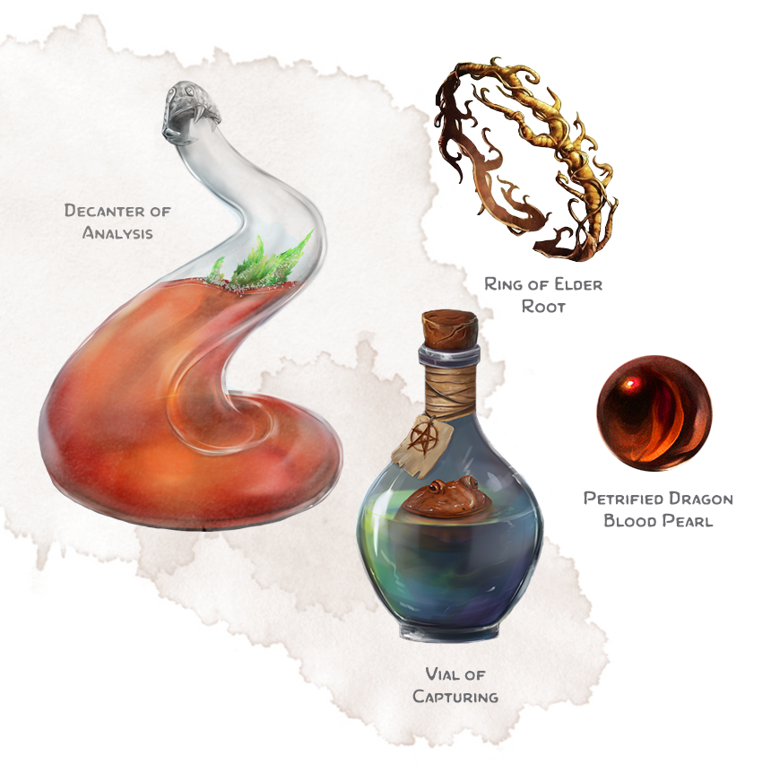
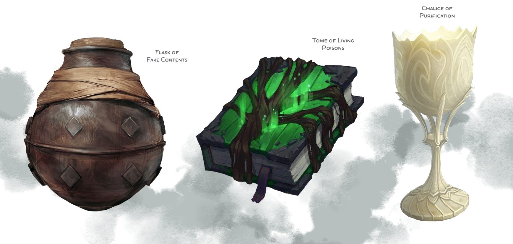

# Magic Items for Poisoners

## Assassins' Gloves
_Wondrous item, uncommon (requires attunement)_

While wearing these gloves, you cannot be harmed by poisons coated on these gloves.

## Ball Bearings of Dispersing
_Wondrous item, common (requires attunement)_

These ball bearings appear completely ordinary, but 25 balls can contain one pint of inhaled poison. As long as the balls are less than 90 ft. away, you can mentally tell them to release their contents as a cloud in a 5-foot cube. The resulting
cloud dissipates immediately afterward.

## Chalice of Purification
_Wondrous item, legendary_

Any poison you pour into this chalice turns into an antidote for that poison. The chalice will continue to produce the antidote until a new poison is poured into it.

## Compass of Natural Toxins
_Wondrous item, common (requires attunement)_

While this compass is on your person, you have advantage when making a check to forage for poison components.

## Decanter of Analysis
_Wondrous item, uncommon_

This crystal decanter returns any potion into its base ingredients for a brief moment. Alchemists use it to identify dangerous poisons.

As an action you can pour a single sample of poison in the decanter. After one minute the poison has completely dissolved into nothing, and you know the name and properties of the poison as well as the recipe to recreate it.

## Flask of Fake Contents
_Wondrous item, uncommon (requires attunement)_

This unremarkable flask can hold one pint of liquid. As long as you can see the flask, you can use an action to mentally switch the real content for either one pint of water, wine, or beer; or an empty flask. You can use an action to restore the real content in the same way.

## Mask of Sweet Air
_Wondrous item, uncommon_

A fine black cloth mask that covers the wearer’s mouth and nose. While wearing the mask, a creature becomes immune to airborne diseases, poisons, and other inhaled hazards.

## Najaran Needle
_Wondrous Item, Uncommon, Attunement (by a Druid, Bard, or Wizard)_

While not attuned to this needle, anyone can use it as a replacement for a normal poisoner's kit.

While attuned to this needle you use it as a spellcasting focus, and the DC of any ability check made with it as a poisoner's kit is reduced by 2.

## Orb of Remembering
_Wondrous item (orb), uncommon (requires attunement)_

This orbs works as a mental library. You can mentally write down anything in it. Reading and writing information takes as much time as with pen and paper.

When you lose attunement to the orb, it loses everything that is written down in it.

## Petrified Dragon Blood Pearl
_Wondrous item (stone), very rare_

This small bead of dragon blood can replace one rare (or less) restorative component when creating an antidote for any poison.

## Stone of Poison Detection
_Wondrous item, common_

When this pale sandstone octahedron comes into contact with any poison, it turns as dark as night for two hours.

## Talonite Triangle
_Wondrous Item (necklace), Very Rare_

Named after the Goddess of Poison and Disease, this triangular pendant allows its wearer to add their proficiency bonus to any roll involved in making poison. This includes gathering and refining components, and crafting poisons.

If the wearer can already add their proficiency bonus, they gain expertise and the bonus is doubled.

## Teapot of Envenoming
_Wondrous Item, Rare_

An enchantment on this teapot poisons everything it brews. Whenever a creature drinks liquid poured from this teapot, it takes 2d6 poison damage. Liquid extracted from the teapot only retains this poisonous property for 1 hour.

## Tome of Living Poisons
_Wondrous item (book), uncommon (2), rare (3), very rare (4)_

This book contains notes on a number of poisons, determined by the rarity of the book. The table below list all possible poisons. The GM decides which poisons or determines it randomly.

If you spend one minute to read the notes of a single poison, it appears in a neat vial on top of the book. The notes for this poison lose their magic after this.

| **d6** | **Poison**           |
| ------ | -------------------- |
| 1      | Assassins' Blood     |
| 2      | Basic Poison         |
| 3      | Drow Poison          |
| 4      | Midnight Tears       |
| 5      | Strangler            |
| 6      | Wisp Lichen Solution |

## Traveler's Flask
_Wondrous item, common_

This double-sided iron flask adjusts the temperature of liquids poured from it. Any liquid poured from the blue-capped side becomes refreshingly cool. Any liquid poured from the red-capped side becomes soothingly warm.

## Vial of Capturing
_Wondrous Item, Uncommon_

With this magic vial you can capture any essence or substance, which physically fits in it.

When the vial is empty you can use an action to deploy the item and succeed on any extraction check. The resulting component must stay in the vial until used in a potion or it will wither away. The vial can only contain one component at a time.

