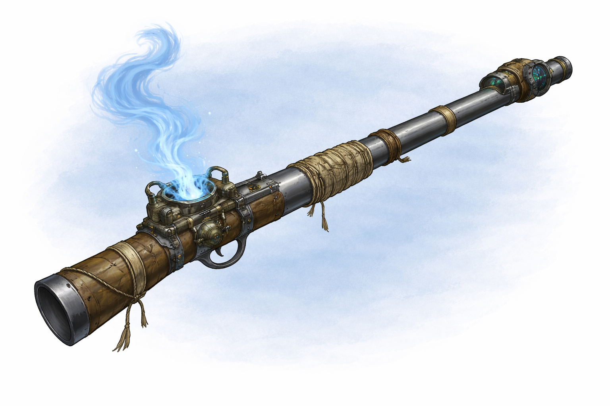

# Magic Weapons

## Bow of Biting

_Weapon (any bow or crossbow), rare (requires attunement)_

When you hit with an attack roll using this magic bow, the target takes an extra 1d6 poison damage.

If you load no ammunition in the weapon, it produces its own, automatically creating one piece of magic ammunition when
you fire.

## Serpentwrought Weapon

_Weapon (any weapon), very rare (requires attunement)_

This weapon is magical and any poison applied to it cannot lose its potency. It also cannot be washed of except by
magical means. Ammunition weapons infuse their ammunition with the poison.

When you apply a second poison to the weapon, the previous is removed.

*Curse.* When you lose attunement to this weapon and after every long rest while you are attuned, you suffer one dose of
the poison currently applied to the weapon.

## Thayan Spear

_Wondrous Item, Rare_

You have a +1 bonus to attack and damage rolls made with this magic weapon.

Any creature that is wounded by this weapon gains vulnerability to piercing damage, except if it already has immunity to
this damage type.

## Prototype farfire firearm

_Weapon, rare (requires attunement)_

You gain a +1 bonus to attack rolls and damage rolls made with this magic weapon. When firing this weapon, a magical
bullet of blue energy appears in the chamber and ready to fire. A bullet produced by this weapon deals Force damage
instead of Piercing damage on a hit, and it disappears after it hits or misses its target. Until it disappears, the
arrow emits dim Light in a 20-foot radius. When making an attack beyond 90 feet, the magical bullet grows in strength
and deals an additional 1d10 damage.

This weapon has the following forge quality.

**Gnomish.** This weapon's precise engineering ensures consistent performance. When you roll damage for this weapon, you
can reroll any damage die that shows a 1 or 2, but you must use the new roll.

This weapon has the following mastery property. To use this property, you must have a feature that lets you use it.

**Slow.** If you hit a creature with this weapon and deal damage to it, you can reduce its Speed by 10 feet until the
start of your next turn. If the creature is hit more than once by weapons that have this property, the Speed reduction
doesn’t exceed 10 feet.

| damage     | weight | qualities | properties                               |
|------------|--------|-----------|------------------------------------------|
| 1d10 force | 8 lbs  | gnomish   | range (40/90), loading, two-handed, slow |

